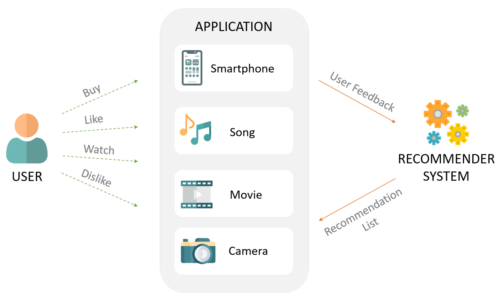

### Recommendation System

A recommendation system is an artificial intelligence or AI algorithm, usually associated with machine learning, that uses Big Data to suggest or recommend additional products to consumers. These can be based on various criteria, including past purchases, search history, demographic information, and other factors.

1. **Demographic Filtering**

- They offer generalized recommendations to every user, based on movie popularity and/or genre.
- The System recommends the same movies to users with similar demographic features.
- Although each user is different , this approach is considered to be too simple.
- The basic idea behind this system is that movies that are more popular and critically acclaimed will have a higher probability of being liked by the average audience.

2. **Content Based Filtering**

- They suggest similar items based on a particular item.
- This system uses item metadata, such as genre, director, description, actors, etc. for movies, to make these recommendations.
- The general idea behind these recommender systems is that if a person liked a particular item, he or she will also like an item that is similar to it.

3. **Collaborative Filtering**

- This system matches persons with similar interests and provides recommendations based on this matching.
- Collaborative filters do not require item metadata like its content-based counterparts.
